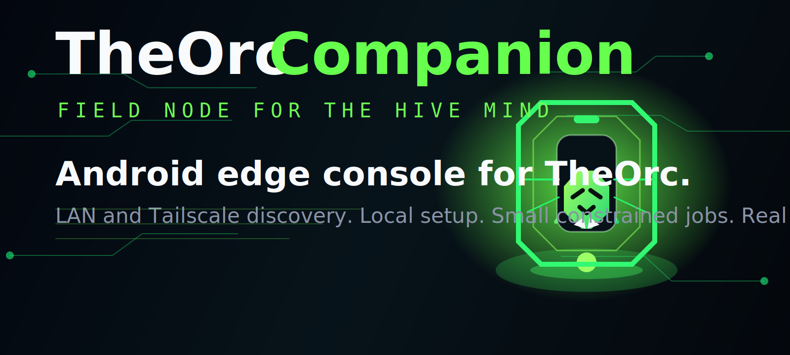
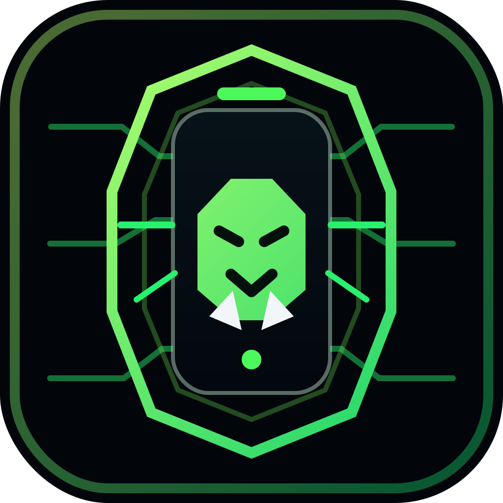
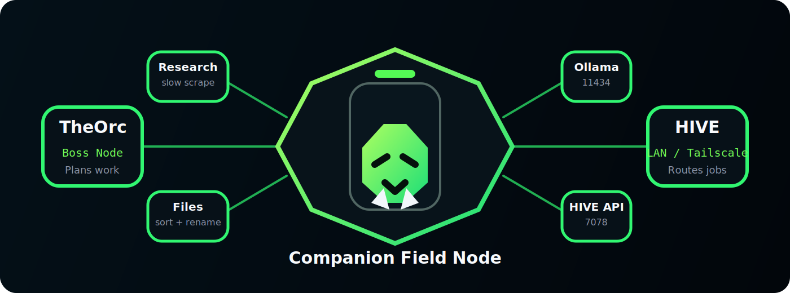

<div align="center">



[](#quick-start)
[](#quick-start)
[](#android-build)
[](#what-it-does-today)

**TheOrc Companion is the field node for TheOrc's HIVE MIND.**

It gives your phone a real job: discover local nodes, verify LAN and Tailscale routes, run first-run setup, and contribute small constrained edge work back to the swarm.

</div>

---

## What is it?

TheOrc Companion is the Android-facing control surface for [TheOrc](https://github.com/hardcoreerik/TheOrc).

Instead of being a fake mobile mockup or a second dashboard that just repeats desktop UI, the companion is aimed at real field-node work:

- discovering TheOrc and Ollama endpoints over **LAN** and **Tailscale**
- probing whether a host actually exposes the HIVE APIs you need
- persisting a local first-run setup profile
- acting as a constrained **companion edge node**
- queueing small jobs that make sense on a lightweight device or helper node

Right now the project is a React app with an Android wrapper, plus a local Express server that handles discovery, setup state, and the edge-job queue.

---

## Visual Language

The branding here is intentionally a sibling to TheOrc, not a clone:

- the same neon-green-on-black warband palette
- the same octagonal circuit frame language
- a **field node / uplink** posture instead of the full boss-orchestrator stance
- a companion emblem built around a mobile device carrying the orc signal

<div align="center">



</div>

---

## What It Does Today

### Network gateway

The companion can:

- enumerate route candidates from `localhost`, private LAN IPs, and Tailscale IPs
- detect a configured TheOrc desktop host from `%APPDATA%\OrchestratorIDE\settings.json`
- probe `http://<host>:7078/hive/info`
- probe `http://<host>:11434/api/tags`
- summarize whether a route is **optimal**, **unstable**, or **offline**

This is the minimum needed for a real phone app to tell the truth about the HIVE instead of pretending a tunnel is healthy when it is not.

### First-run setup

The companion persists setup state to:

`%APPDATA%\TheOrcCompanion\settings.json`

That setup profile currently includes:

- companion name
- preferred host
- whether to join the HIVE MIND
- enabled edge capabilities
- battery cutoff percentage
- whether metered network use is allowed

### Constrained edge jobs

The companion does **not** invent a new boss role. It follows the role-architecture direction from TheOrc:

- `scrape_url`
  - logical role: `RESEARCHER`
  - execution lane: `RESEARCHER`
  - capability: `slow_scrape`
- `organize_directory`
  - logical role: `DATA_ENGINEER`
  - execution lane: `CODER`
  - capability: `file_sorting`

Current built-in job types:

- slow web scraping / summary extraction
- file sorting
- file naming suggestions

Those are intentionally narrow, useful, and cheap enough to fit a helper-node model.

---

## HIVE Shape

<div align="center">



</div>

The intended relationship is:

1. TheOrc remains the planner and boss node.
2. The companion becomes a truthful network/control console.
3. Small edge-safe workloads can be routed to the companion node when capability and battery gates allow it.

This repo is the bridge between "phone UI for a demo" and "phone as a real member of the swarm."

---

## Quick Start

### Web development

```powershell
git clone https://github.com/hardcoreerik/TheOrcCompanion.git
cd TheOrcCompanion
npm install
npm run dev
```

Then open:

`http://127.0.0.1:3000`

### Requirements

- Node.js
- TheOrc desktop environment on the same LAN or Tailscale network if you want real route testing
- Ollama if you want the companion to verify model availability

### Optional AI key

If you want the Google AI Studio orchestration and research endpoints active, provide a Gemini key in local env configuration.

Without it, parts of the original AI Studio-generated app still fall back to simulation behavior.

---

## Android Build

This repo now includes a Capacitor Android wrapper.

### Sync the Android shell

```powershell
npm run android:sync
```

### Open in Android Studio

```powershell
npm run android:open
```

### Build manually with Gradle

```powershell
cd android
.\gradlew.bat assembleDebug
```

The debug APK lands at:

`android/app/build/outputs/apk/debug/app-debug.apk`

### Important note about the current Android flow

The Android shell currently points at the local desktop-backed server URL defined in:

[`capacitor.config.ts`](capacitor.config.ts)

That means the phone is meant to talk back to a live desktop TheOrc Companion server during development. If you move to another machine or another Tailscale IP, update that URL before syncing again.

---

## Repo Layout

| Path | Purpose |
|---|---|
| `src/App.tsx` | Main dashboard tabs and top-level app layout |
| `src/components/AndroidCompanionHub.tsx` | Real companion setup, route testing, and edge-job UI |
| `server.ts` | Discovery, probing, setup persistence, and companion-node job queue |
| `android/` | Capacitor Android wrapper project |
| `assets/` | README branding and companion visuals |

---

## Current Status

This project is no longer just the stock AI Studio export. It now has:

- real LAN/Tailscale route discovery
- real HIVE and Ollama probing
- persisted first-run setup
- Android packaging and deployment
- a companion-node job queue aligned with TheOrc role architecture

What it does **not** claim yet:

- full distributed HIVE task execution from TheOrc
- autonomous mobile inference scheduling
- production-ready offline Android-native API handling

That honesty matters. The companion is now useful, but it is still in the "groundwork and field-node bring-up" phase.

---

## Next Steps

The strongest next upgrades are:

- signed work packets from TheOrc into the companion queue
- capability heartbeat reporting back to HIVE
- route auto-selection between LAN and Tailscale
- tighter Android-native handling for setup, battery gating, and background-safe node behavior
- tiny local model adapters for file triage, rename suggestion, and slow scrape summarization

---

## Related Project

The desktop boss, HIVE design, and broader swarm runtime live here:

[TheOrc](https://github.com/hardcoreerik/TheOrc)

If TheOrc is the warboss, this repo is the scout, relay, and field terminal.
